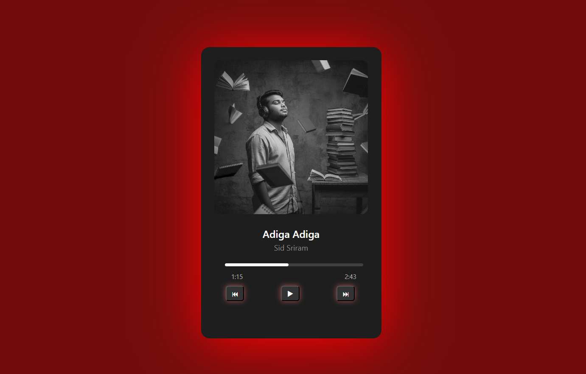

<h1 align="center">A Simple Responsive Music Website</h1>
 

 
<h2 align="center">About This...</h2>
This is a simple resonsive music website, this built using HTML CSS And Js.
 
=> We can change the songs. 
=> We can play and pause the songs. 
=> We can See the Duration of the song. 
=> We can go Priveous and Next song by clicking. 
=> It is portable for all the devices. 
 
<a href="https://greencoderprashu.github.io/Music-Player/" 
   target="_blank"
   style="
      display: inline-block;
      background: #55ff00; 
      color: #0f172a; 
      text-decoration: none;
      padding: 12px 24px; 
      border-radius: 12px; 
      font-size: 1rem;
      font-weight: 600; 
      cursor: pointer;
      transition: all 0.2s ease;
      box-shadow: 0 0 15px rgba(85, 255, 0, 0.5);
   "
   onmouseover="this.style.transform='scale(1.05)'; this.style.boxShadow='0 0 25px rgba(85, 255, 0, 0.8)'" 
   onmouseout="this.style.transform='scale(1)'; this.style.boxShadow='0 0 15px rgba(85, 255, 0, 0.5)'">
   🎵 View Music Player
</a>
<h2 align="center">Thank You</h2>
